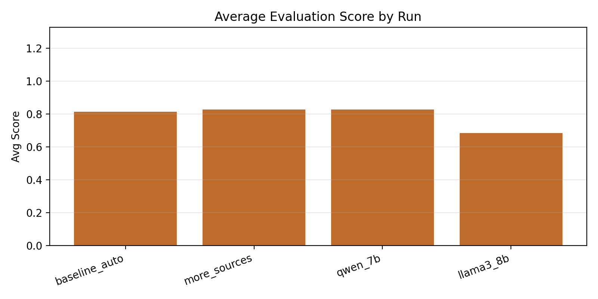
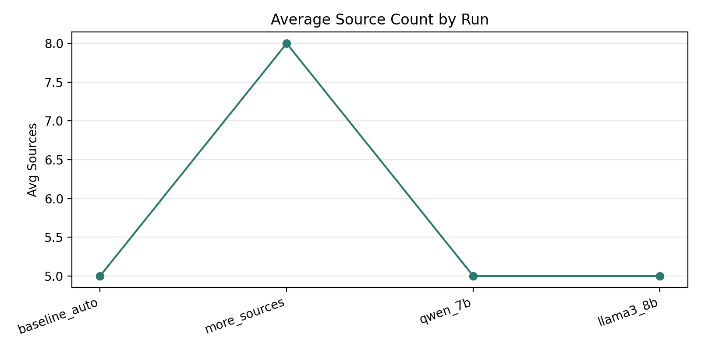
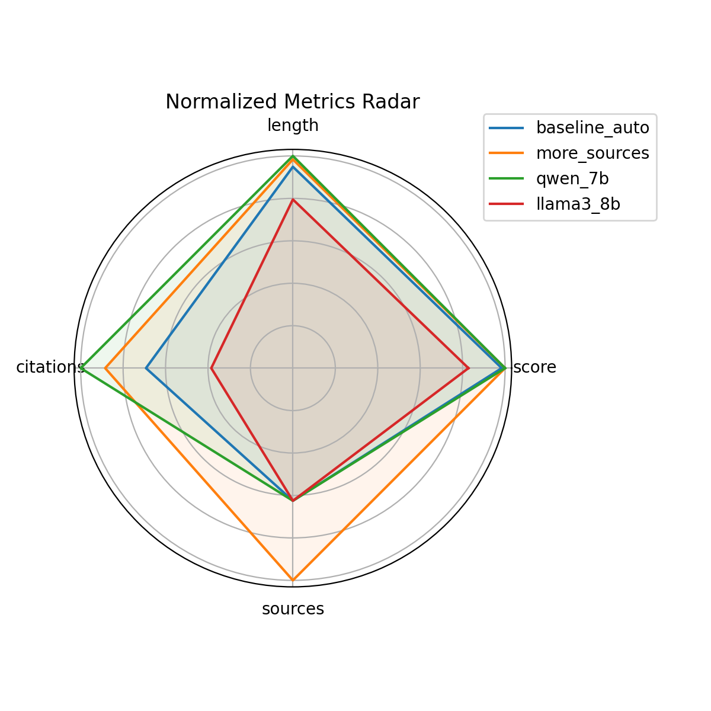
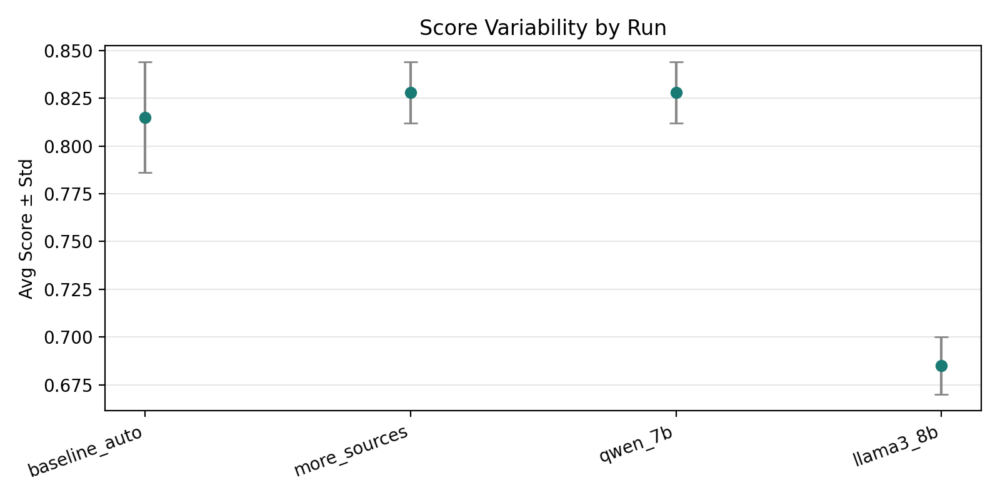

# Web-page

This is a lightweight CLI agent that takes a topic, searches the web, extracts key information, and produces a one-page summary in Markdown.

## Expanded Stack
- Backend API: FastAPI + SQLite (background report generation)
- Retrieval enhancement: domain filtering, dedup, snippet extraction
- Multi-stage pipeline: retrieval → compression → outline → synthesis
- Frontend: React + Vite + Tailwind
- Multi-model: provider/model routing via request params (per-stage override optional)

## What It Does
- Searches the web for the topic
- Visits top results to extract key points
- Generates a concise summary with citations
- Saves the summary to `outputs/<topic>.md`

## Setup
1. Create a virtual environment (optional)
2. Install dependencies:

```bash
pip install -r requirements.txt
```

3. Set an HF token if you use the Hugging Face Inference API:

```bash
export HF_TOKEN=YOUR_TOKEN
```

## Usage

```bash
python web_collect_agent.py "your topic"
```

Common options:
- `--lang zh|en` Output language
- `--min-sources 3` Minimum sources to cite
- `--max-results 8` Max web search results to scan
- `--output outputs/custom.md` Output file path
- `--model-id <hf-model-id>` Override HF model id
- `--provider <provider>` Override inference provider
- `--api-key <key>` Provider API key (e.g., DeepSeek/OpenAI)
- `--base-url <url>` Provider base URL (e.g., https://api.deepseek.com/v1)

## Output
The agent writes a Markdown file containing:
- Title
- Overview paragraph
- Key points with citations
- Notable stats (if any)
- Sources list

## Simple Web UI
Run the minimal Flask UI:

```bash
python web_ui.py
```

Then open `http://localhost:8000` in your browser.

## FastAPI + React UI
Backend:

```bash
python -m uvicorn backend.app:app --reload --port 8000
```

Frontend:

```bash
cd frontend
npm install
npm run dev
```

The frontend reads the API base from `VITE_API_BASE` (defaults to `http://localhost:8000`).

## Pipeline Stages
1. Retrieval: search + visit pages and collect snippets.
2. Compression: per-source evidence bullets.
3. Outline: structured report plan.
4. Synthesis: final one-page report.

## Evaluation Module
Single report evaluation (heuristics + optional LLM judge):

```bash
curl -X POST http://localhost:8000/api/evals \\
  -H 'Content-Type: application/json' \\
  -d '{\"report_id\": \"<report_id>\", \"min_sources\": 3}'
```

Batch evaluation uses a dataset JSON file:

```bash
curl -X POST http://localhost:8000/api/evals/batch \\
  -H 'Content-Type: application/json' \\
  -d '{\"dataset_path\": \"backend/eval_dataset.sample.json\"}'
```

## Reproducible Experiments (for Defense)
We include a minimal experiment harness to compare retrieval settings across topics.

1) Edit experiment runs:
`experiments/experiment_config.json`

2) Run experiments (requires model access + web retrieval):

```bash
python backend/experiments.py \\
  --dataset backend/eval_dataset.sample.json \\
  --config experiments/experiment_config.json \\
  --provider auto
```

3) Results are saved under `results/` as JSON. Use the summary section to build a comparison table in your report.

## Auto-Generate Tables & Plots
After an experiment run, generate a Markdown table + charts:

```bash
python results/report.py --input results/experiment_<id>.json --output results/report.md
```

This produces `results/report.md`, plus `avg_scores.png`, `avg_sources.png`, `radar_metrics.png`, and `score_errorbars.png`.

## Defense-Ready Outputs
- Markdown table + LaTeX table for reports
- Radar chart for normalized metrics
- Error-bar chart for score variance

## Experiment Results (Latest Run)
After generating the report, place the latest artifacts under `results/` and update the links below:





## Notes
- The agent uses `WebSearchTool` and `VisitWebpageTool` from smolagents.
- Output length is constrained to roughly one page.
